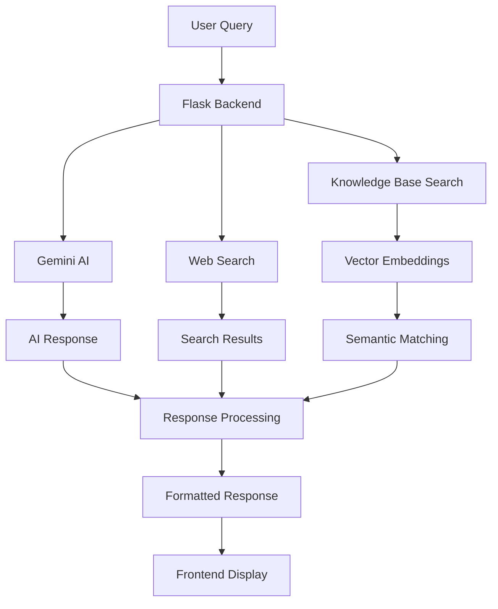

# 🌿 Nutrition & Ayurveda Chatbot

<p align="center">
  
  
  
  
</p>

<p align="center">
  <em>🌱 Bridging Ancient Wisdom with Modern Nutrition Science 🌱</em>
</p>

---

## 🎯 About

An **intelligent chatbot** powered by **Google Gemini 2.0 Flash** that provides personalized nutritional guidance and Ayurvedic dietary recommendations. This advanced system combines **modern nutritional science** with **traditional Ayurvedic wisdom** to help you make informed dietary choices.

---

<div align="center">

### 🌟 Key Highlights

| Feature | Description |
|---------|-------------|
| 🧠 **AI-Powered** | Google Gemini 2.0 Flash integration |
| 🍎 **900+ Foods** | Comprehensive nutritional database |
| 🌿 **Ayurvedic** | Traditional dosha and wisdom integration |
| ⚡ **Smart Search** | Vector embeddings for accurate results |
| 📚 **Learning** | Improves from user interactions |
| 🚀 **Fast** | Optimized caching and performance |

</div>

---

## ✨ Features

<div align="center">

### 🧠 AI-Powered Intelligence
```diff
+ Google Gemini 2.0 Flash integration
+ Context-aware conversations with memory
+ Smart learning from user feedback  
+ Multi-source information retrieval
```

### 🍎 Comprehensive Nutritional Database
```diff
+ 900+ food items database
+ Detailed nutritional profiles
+ Ayurvedic properties mapping
+ Smart semantic search with embeddings
```

### 🌿 Ayurvedic Wisdom
```diff
+ Traditional dosha analysis (Vata, Pitta, Kapha)
+ Ayurvedic taste classifications
+ Personalized body constitution recommendations
+ Herbal and dietary guidance
```

### ⚡ Advanced Features
```diff
+ Real-time web search integration
+ Deep research mode for comprehensive info
+ Response caching for performance
+ Rate limiting and optimization
+ Responsive web interface
```

</div>

---

## 🚀 Quick Start

<p align="center">
  <strong>🔥 Get up and running in 5 minutes! 🔥</strong>
</p>

### 📋 Prerequisites
- **Python 3.8+** 
- **Google API Key** (for Gemini)
- **Google Search API Key** (optional, for web search)

---

### ⚙️ Installation

<div align="center">

#### Step 1: Clone Repository
```bash
git clone <repository-url>
cd Nutritional_ChatBot
```

#### Step 2: Install Dependencies  
```bash
pip install -r requirements.txt
```

#### Step 3: Environment Setup
```bash
# Create .env file
GOOGLE_API_KEY=your_gemini_api_key_here
GOOGLE_SEARCH_ENGINE_ID=your_search_engine_id_here
```

#### Step 4: Launch Application
```bash
python Chatbot.py
```

#### Step 5: Access Interface
🌐 Navigate to `http://localhost:5000`

</div>

---

## 📊 Knowledge Base

<p align="center">
  <strong>🌿 Comprehensive Food Database 🌿</strong>
</p>

<div align="center">

| 📂 Category | 📝 Description | 🎯 Focus |
|------------|---------------|----------|
| **Cereals, Pulses & Lentils** | Detailed nutritional and Ayurvedic information | Protein-rich foods |
| **Vegetables & Greens** | Seasonal recommendations and health benefits | Vitamins & minerals |
| **Nutritional Values** | Macronutrient breakdowns for each food item | Calories, protein, carbs, fats |
| **Ayurvedic Properties** | Traditional classifications and dosha effects | Rasa, Virya, Guna, Vipaka |

</div>

---

### 🗂️ Sample Data Structure

```json
{
  "id": "moong-dal",
  "title": "Moong Dal (मूंग दाल)",
  "category": "Cereals,Pulses,Lentils & Legumes",
  "nutrition": {
    "calories": "347.0",
    "protein": "24.0",
    "carbs": "63.0",
    "fats": "1.2"
  },
  "ayurveda": {
    "rasa": "Sweet (मधुर)",
    "virya": "Cooling (शीत)",
    "guna": "Light (लघु)",
    "vipaka": "Sweet (मधुर)",
    "dosha_effects": "Vata↓ Pitta↓ Kapha↓"
  }
}
```

---

## 🎯 Usage Examples

<div align="center">

### 🍎 Basic Nutritional Queries
```bash
"What are the nutritional benefits of moong dal?"
"How many calories in chana dal?"
"Compare protein content of toor dal vs masoor dal"
```

### 🌿 Ayurvedic Guidance
```bash
"What foods are good for Vata dosha?"
"Is masoor dal heating or cooling?"
"Recommend foods for Pitta constitution"
```

### 💚 Health & Diet Planning
```bash
"Suggest a balanced meal plan for digestion"
"What lentils help control blood sugar?"
"Create a sattvic diet recommendation"
```

</div>

---

## 🏗️ Architecture

<p align="center">
  <strong>🔧 System Architecture Overview 🔧</strong>
</p>

<div align="center">

### 🖥️ Backend Components
```diff
+ Flask Web Server: RESTful API with CORS support
+ Gemini Integration: Advanced AI responses and search
+ Vector Search: Semantic similarity using embeddings
+ Learning System: Continuous improvement from interactions
+ Caching Layer: Performance optimization
```

### 🎨 Frontend Features
```diff
+ Modern Chat Interface: Clean, responsive design
+ Real-time Messaging: Smooth conversation flow
+ Source Attribution: Transparent information sourcing
+ Mobile Optimized: Works on all devices
```

</div>

---

### 🔄 System Flow

<div align="center">



</div>

---

## 🔧 Configuration

### Environment Variables
- `GOOGLE_API_KEY`: Required for Gemini AI functionality
- `GOOGLE_SEARCH_ENGINE_ID`: Optional for web search capabilities

### Customization Options
- **Knowledge Base**: Modify `kb.json` to add/customize food items
- **Embedding Cache**: Automatically cached for performance
- **Learning Database**: Stores interaction history for improvement

## 📈 Performance Features

<p align="center">
  <strong>⚡ Optimized for Speed & Efficiency ⚡</strong>
</p>

<div align="center">

### 🚀 Optimization Techniques
| Feature | Duration | Impact |
|---------|----------|--------|
| **Response Caching** | 1 hour | ⚡⚡⚡ |
| **Search Caching** | 30 minutes | ⚡⚡ |
| **Rate Limiting** | 10 req/min | 🛡️ |
| **Embedding Cache** | Persistent | 💾 |
| **Memory Management** | Auto-cleanup | 🔄 |

### 🧠 Learning Capabilities
```diff
+ Interaction Learning: Improves from successful responses
+ Concept Extraction: Identifies key nutritional concepts
+ Feedback Integration: User ratings improve future responses
+ Knowledge Expansion: Grows understanding over time
```

</div>

---

## 🛠️ Development

<p align="center">
  <strong>👨‍💻 Developer Information 👨‍💻</strong>
</p>

### 📁 Project Structure
```
Nutritional_ChatBot/
├── Chatbot.py              # Main application server
├── requirements.txt        # Python dependencies
├── .env                   # Environment variables
├── kb.json               # Knowledge base (JSON format)
├── knowledge_base.csv    # Raw knowledge base data
├── public/               # Frontend assets
│   ├── index.html       # Main chat interface
│   ├── styles.css       # Styling
│   └── chat.js          # Frontend logic
└── learning_database.json # Learning system storage
```

### 🔌 API Endpoints
| Method | Endpoint | Description |
|--------|----------|-------------|
| `GET` | `/` | Serve the chat interface |
| `POST` | `/chat` | Process chat messages |
| `POST` | `/feedback` | Submit user feedback |

---

## 🤝 Contributing

<p align="center">
  <strong>🌟 We Welcome Contributions! 🌟</strong>
</p>

<div align="center">

### 🔄 Contribution Workflow
1. **Fork** the repository
2. **Create** a feature branch
3. **Make** your changes
4. **Test** thoroughly
5. **Submit** a pull request

### 🚀 Areas for Enhancement
```diff
+ Multi-language Support: Add more languages
+ Recipe Integration: Connect recipe databases
+ User Profiles: Personalized recommendations
+ Mobile App: Native mobile applications
```

</div>

---

## 📝 License

<p align="center">
  
</p>

This project is licensed under the **MIT License** - see the LICENSE file for details.

---

## 🙏 Acknowledgments

<div align="center">

### 🌟 Special Thanks To
```diff
+ Google Gemini for powerful AI capabilities
+ Ayurvedic texts for traditional wisdom
+ Nutritional databases for scientific data
+ Open source community for tools and libraries
```

</div>

---

## 📞 Support & Contact

<p align="center">
  <strong>💬 Need Help? We're Here for You! 💬</strong>
</p>

<div align="center">

### 🛠️ Get Support
| Method | Link |
|--------|------|
| **GitHub Issues** | [Create an Issue](https://github.com/your-repo/issues) |
| **Documentation** | [View Docs](https://docs.your-repo.com) |
| **Discussions** | [Join Discussion](https://github.com/your-repo/discussions) |

### 📧 Reach Out
- 🐛 **Bug Reports**: Create an issue on GitHub
- 💡 **Feature Requests**: Start a discussion
- 📚 **Questions**: Check existing issues first

</div>

---

<div align="center">

## 🌟 Show Your Support!

<p align="center">
  <strong>If you find this project helpful, please consider: </strong>
</p>

<p align="center">
  
  
  
</p>

</div>

---

<p align="center">
  <strong>
    🌱 Start your journey to better health with the wisdom of nutrition and Ayurveda! 🌱
  </strong>
</p>

<p align="center">
  <em>
    Made with ❤️ by the Nutrition & Ayurveda Chatbot Team
  </em>
</p>

<p align="center">
  
  
  
</p>
